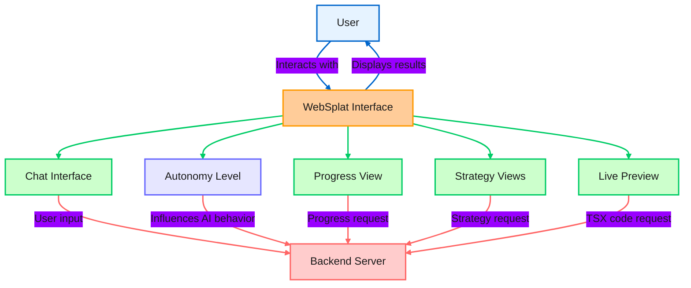
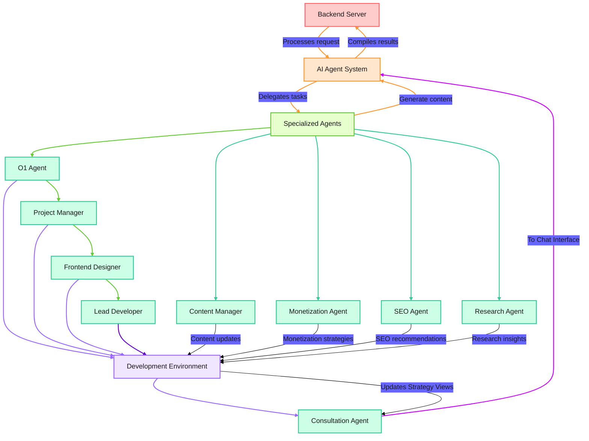

# WebSplat MVP Workflow

## Frontend Workflow

## Backend Workflow

## Workflow Explanation

1. The user interacts with the WebSplat Interface, which includes a chat interface (connected to the Consultation Agent), progress view, strategy views, and a live preview.

2. User requests are sent to the Backend Server.

3. The Backend Server processes the request and passes it to the AI Agent System.

4. The AI Agent System, influenced by the user-set Autonomy Level, delegates tasks to Specialized Agents:
   - O1 Agent: Provides high-level reasoning and decision-making
   - Project Manager: Coordinates tasks and ensures project coherence
   - Frontend Designer: Creates UI/UX designs
   - Lead Developer: Generates code based on designs
   - Content Manager: Handles user-provided content
   - Monetization Agent: Develops monetization strategies
   - SEO Agent: Optimizes for search engines
   - Research Agent: Conducts web searches for relevant information

5. The Consultation Agent communicates with the user via the Chat Interface and updates the AI Agent System.

6. The Development Environment receives updates from the O1 Agent, Project Manager, Frontend Designer, Lead Developer, Content Manager, Monetization Agent, SEO Agent, and Research Agent.

7. The Development Environment sends updates to the Consultation Agent, which in turn updates the Strategy Views.

8. The AI Agent System compiles results and sends them back to the Backend Server.

9. The Backend Server sends the response to the WebSplat Interface.

10. The WebSplat Interface displays the results to the user in various views:
    - Chat Interface: Shows conversation with the AI (primarily the Consultation Agent)
    - Progress View: Displays project progress
    - Strategy Views: Shows specific strategies (e.g., monetization, SEO)
    - Live Preview: Renders the generated TSX code in real-time

11. The user can request progress reports or strategy explanations, which are then displayed in the respective views.

12. The process continues iteratively as the user refines their requirements and the AI system generates and improves the website.
